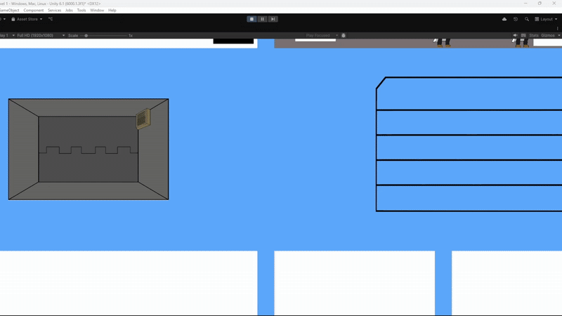

# Základní koncept
2D Rogue-like/lite SCP managment Simulator

Game Engine : Unity

## Game Loop
Hraje se do zatim neurčené hloubky a míry výzkumu (1 level/Výprava = minimální požadovaný výzkum a hloubka ) 

zároveň bude hráč muset davat pozor na hloubku protože čim větši hloubka tim více nebezpečné to je (Ruzné přepadení od fakcí/monster atd...) 

pokud je hráč připravený dostane různé bonusy/věci které mu pomužou v dalšich výpravach

ukolem během výpravy bude dostat z monster požadovanou měnu (Výzkum/Zkušenost a Pochopení/Výzkum dotyčného monstra ) pomocí kterého se může dostat hlouběji či si za "Pochopení" koupit od daného monstra výbavu (Zbraně a Brnění...).

**TLDR**: Manažujte svoje zaměstnance a pracujte s SCP-like monstry z kterých, extrahujete zbraně a výzbroj, pro výzkum abyste se dostali do větších hloubek.
   
Rouge-like zpočivá v tom že na začátku každé výpravy si hráč vybere z náhodné nabídky monster 
u kteŕych zatim kvuli nedostatečnému výzkumu nevidí jeho název vidi pouze krátky popisek o něm či něco spojeného s nim.

Monstra jsou rozdělená na urovně nebezpeči přístup k nebezpečnějším se odemyká podle hloubky + počtem výprav

Příklad/Inspirace z Lobotomy Corporation:

Výzkum se dostane z práce s monstry která je rozdělena na 4 typy s tím že každé monstrum reaguje jinak na každy typ (někdy vraždou :D nebo utěkem a to skončí genocidou).

Praci provádí zaměstnanci kteŕy mají výbavu a staty které se zvedají po dokončení práce.

Úspěšnost práce se odvijí od statu zaměstannce, ti se naverbují před výpravou, mohou mít různé mentalní problémy, vlastnosti (např. poseroutka = 2x sanity dmg, talentovaný = +1 level do každého statu) a staty. 

Inspirace z Lobotomy Corporation:

Náš prototyp: (s placeholdery)  

### Controls
camera: WASD nebo right-click + tahnutí
interact: left-click

## Cílové Publikum

Věk: 15+

Fanoušci Lobotomy Corporation a lidi který si užívají Micro-management, Obtížnost, visual novely, rogue-like elementy

### Záměr
**B O L E S T**

   Samozřejmě zábava
